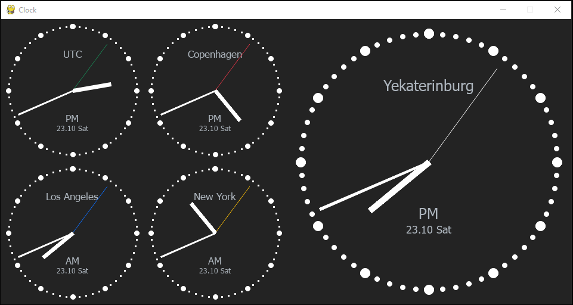

# Cross-OS window Clock app

## Might be interesting

- I use transition matrix(from one space to another) to rotate arrows.
- `asyncio` to make each object on screen in its own coroutine
- Markup from `settings.py` file
- TODO: Shows weather
